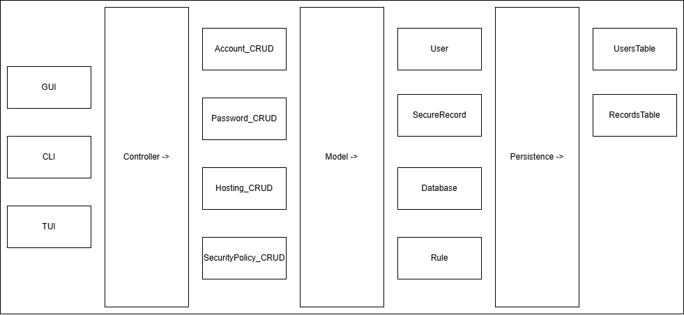

# Orchid Development Documentation

## Default Features
1. Automated installation for Linux and Windows
1. Secure Username and Password Verification via a randomly salted Argon2 Password Hash offered by the Bouncy Castle JCA provider
3. AES Encrypted and Securely Random Password Generation via the JCA
4. Default MySQL Database Storage via JDBC
5. Secure Anti-SQL Injection techniques such as Input Verification with regex, Limited Views and Permissions, and Parameterized Queries
6. Custom Exception Handling
7. Maven Build in VS Code, which allows the addition of dependencies for Bouncy Castle and JDBC

## Advanced User Features
1. Customizable UI
    1. Obscure passwords when logged in, update and delete password information
    2. Faster retrieval time for passwords
    3. Populated account tab for updating and deleting account data
    4. Populate settings/extensions tab for customizing UI look-and-feel
2. Customizable backend options:
    1. Expanded database hosting options for local, cloud, or self hosted databases
    2. Expanded security options/defaults/policies for different use cases or advanced customization
    3. Randomly generated environment variables used for database connection credentials. Generated on installation and can be regenerated according to security policies.
3. CLI/TUI lightweight option
    1. Using picocli, there will be a stripped down, light weight version of the project that can be interacted with via the CLI or a TUI. picocli as it has better security options and thread safety compared to Apache Commons CLI.
    2. Each function or subsystem in Orchid will have it's own CLI or subcommand, such that users can use specific tools like encryption, decryption, database read/write, password generation, and more whenever I think of it.

## Architecture
The architecture that the the system will be adhering to is an MVVM model that will allow the maximum amount of customizability. This is a dedicated desktop application, and is not being designed with a web interface in mind. Things like that already exist.

The primary usage and MVP of orchid is a native executable CLI tool for Unix-based systems, specifically Ubuntu. It will have a high degree of customizability and is primarily for use by advanced users. Later versions with a TUI and GUI will be more user-friendly, but still built on top of the original CLI tool.

By default, all data is hosted locally for maximum security. However, through the `Hosting_CRUD` controller/tool, it should be possible to set a new location to host specifically the `RecordsTable`. The `UsersTable` should always be locally hosted. Security policies such as stronger encryption schemes, custom input validation, stronger salting, and other miscellanious cryptographic settings can be set via the `SecurityPolicy_CRUD` controller. This should allow a customizable level of system security while still maintaining an acceptable default level of security.

## Deployment Strategy
Much of the necessary code is already written in Java, so I am reluctant to rewrite it in another langugage like Go to make the CLI easy. The deployment strategy will be to use GraalVM and picocli to create an easy to download executable file.

### Testing
I will use a CI/CD pipeline in Github Actions to automate my testing. I will also use a static application security testing tool to find any obvious vulnerabilities, as well as a fuzzer to find any possibly malformed inputs. Code coverage is secondary to test quality. I will also have some friendly neighborhood red teamers attempt to break it, and I will perform penetration tests myself given what I know about the system.

### Deployment Schedule
There is no fixed schedule. Once an epic is completed, a new version will be released and tagged.

### 